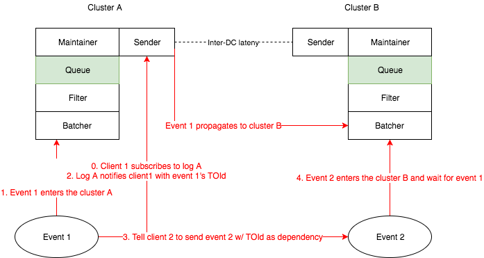
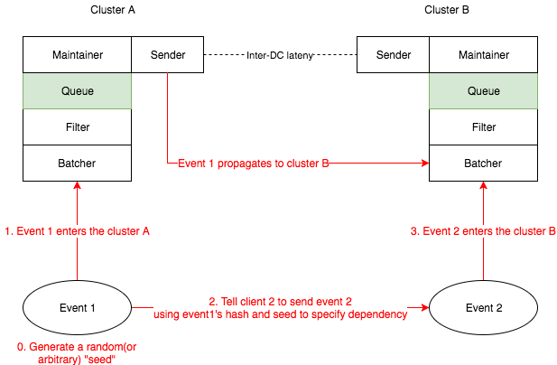

# Token w/ deferred records v.s. w/o deferred records

## 1k events per second for 60 secs

<table>
  <tr>
    <td></td>
    <td>w/ deferred records</td>
    <td>w/o deferred records</td>
    <td>Hash</td>
  </tr>
  <tr>
    <td>maintainer1</td>
    <td>31.69s</td>
    <td>33.92s</td>
    <td>30.02s</td>
  </tr>
  <tr>
    <td>maintainer2</td>
    <td>31.60s</td>
    <td>33.70s</td>
    <td>29.84s</td>
  </tr>
  <tr>
    <td>propagation 50 percentile</td>
    <td>3932ms</td>
    <td>7575ms</td>
    <td>216ms</td>
  </tr>
  <tr>
    <td>propagation 95 percentile</td>
    <td>8998ms</td>
    <td>11209ms</td>
    <td>316ms</td>
  </tr>
</table>

## 10k events per second for 60 secs

<table>
  <tr>
    <td></td>
    <td>w/ deferred records</td>
    <td>w/o deferred records</td>
    <td>Hash</td>
  </tr>
  <tr>
    <td>maintainer1</td>
    <td>86.16s</td>
    <td>86.84s</td>
    <td>31.94s</td>
  </tr>
  <tr>
    <td>maintainer2</td>
    <td>81.69s</td>
    <td>80.76s</td>
    <td>31.76s</td>
  </tr>
  <tr>
    <td>propagation 50 percentile</td>
    <td>16706ms</td>
    <td>17803ms</td>
    <td>2587ms</td>
  </tr>
  <tr>
    <td>propagation 95 percentile</td>
    <td>60539ms</td>
    <td>59647ms</td>
    <td>5592ms</td>
  </tr>
</table>

# TOId v.s. Hash

## TOId

Dependency resolved by the use of token. Check if the max TOId in token is greater than event 2's prerequisite TOId. 

## Hash

Dependency resolved by querying indexer. All the events in same dependency chain have same "seed". Queue sends the prerequisite hash of event 2's and seed to indexer, and indexer replies whether the prerequisite event has already been recorded.

<table>
  <tr>
    <td></td>
    <td>TOId</td>
    <td>Hash</td>
  </tr>
  <tr>
    <td>Intra-DC traffic</td>
    <td>Passing token(smaller)</td>
    <td>Querying indexer(larger)</td>
  </tr>
  <tr>
    <td>Records propagation</td>
    <td>Total order(slower)</td>
    <td>Only casual order(faster)</td>
  </tr>
</table>

### Enhancement

* Memcached indexer,

* Token carries recently appended records' hash (fast-forwarding) 

Throughput: **N** appends per second, **D** of which has dependency

**M** Instances, record of size **1 KB**

<table>
  <tr>
    <td>In</td>
    <td>TOId</td>
    <td>Hash</td>
  </tr>
  <tr>
    <td>From last stage</td>
    <td>N/M KB/s</td>
    <td>N/M KB/s</td>
  </tr>
  <tr>
    <td>Token arrival</td>
    <td>0</td>
    <td>(N-D) KB/s</td>
  </tr>
  <tr>
    <td>Indexer response</td>
    <td>0</td>
    <td>D bits/s</td>
  </tr>
  <tr>
    <td></td>
    <td></td>
    <td></td>
  </tr>
</table>

<table>
  <tr>
    <td>Out</td>
    <td>TOId</td>
    <td>Hash</td>
  </tr>
  <tr>
    <td>To maintainer</td>
    <td>N/M KB/s</td>
    <td>N/M KB/s</td>
  </tr>
  <tr>
    <td>Pass token</td>
    <td>0</td>
    <td>(N-D) KB/s</td>
  </tr>
  <tr>
    <td>Ask indexer</td>
    <td>0</td>
    <td>128D bits/s</td>
  </tr>
  <tr>
    <td></td>
    <td></td>
    <td></td>
  </tr>
</table>

Ref:

[go-cache]([https://github.com/patrickmn/go-cache](https://github.com/patrickmn/go-cache))

[groupcache]([https://github.com/golang/groupcache](https://github.com/golang/groupcache))

