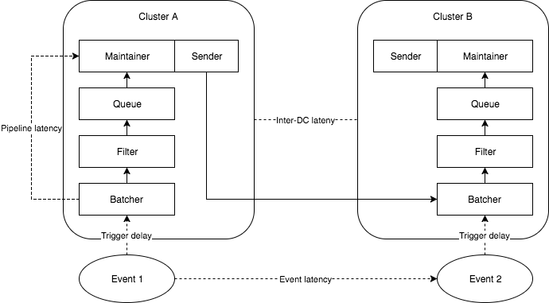

# Casuality experiment

In this experiment, two clusters with single component in each stage are created. The following diagram shows the topology.

* **Inter-DC latency** is the latency between two data centers. In the experiment, [this script](delay.sh) uses tc to create artificial latency between two components in different clusters.
* **Pipeline latency** is the time a record stays in the whole pipeline. In other word, it's the difference between the timestamp a record entering the batcher and hitting the maintainer.
* **Event latency** is the real-world delay between two dependent events.

In the scenario that event 1 causes event 2, we want to reserve the causal dependency in the shared log. Event 1 will be stored in data center A and event 2 will be stored in data center B. The remote record will be propagated by sender(bundled with log maintainer), so we can observe two event records in causal order in each data center.